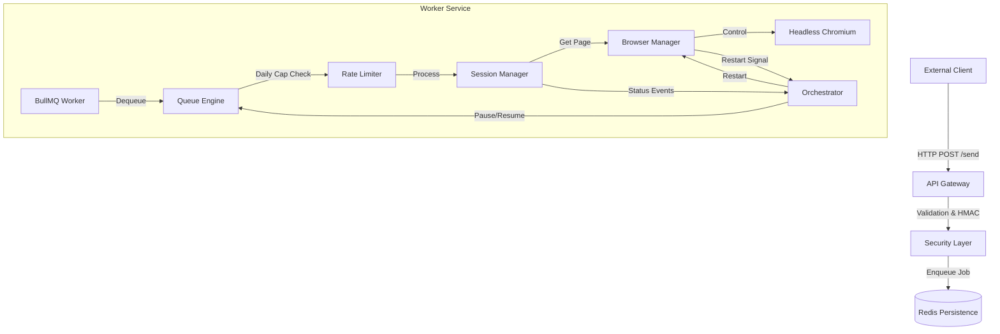

# Technical Blueprint: Hardened WhatsApp Automation Service

**Version**: 1.0.0  
**Date**: October 26, 2023  
**Status**: Production-Ready / Hardened

---

## 1. System Overview

The **Hardened WhatsApp Automation Service** is a specialized, high-reliability microservice designed to interface with WhatsApp Web programmatically. Unlike standard scraping solutions, this system is engineered with "hardened" characteristics—stealth evasion, memory resilience, extensive error recovery, and strict rate limiting—to operate stably in hostile or resource-constrained environments (e.g., Docker/Railway).

### Core Philosophy
*   **Fail-Closed Security**: Operations halt immediately upon critical failures (Redis disconnect, Ban detection) to prevent account compromise or data loss.
*   **Resilience over Speed**: Prioritizes session stability and ban avoidance over raw throughput.
*   **Resource Containment**: Aggressive memory management and process guarding to prevent localized resource exhaustion.

---

## 2. Architectural Blueprint

The system architecture follows a **Command-Query Responsibility Segregation (CQRS-lite)** pattern, separating the API ingestion layer from the heavy-duty browser execution layer, bridged by a persistent Redis-backed job queue.

### 2.1 Core Modules

| Module | Responsibility | Key Components |
| :--- | :--- | :--- |
| **Orchestrator** ([index.ts](file:///Users/mastersam/Documents/whatsapp-api/whatsapp-automation-service/src/index.ts)) | Application lifecycle, service wiring, global error handling. | [bootstrap()](file:///Users/mastersam/Documents/whatsapp-api/whatsapp-automation-service/src/index.ts#12-100), Signal Handlers, Global Event Listeners |
| **API Gateway** (`src/api`) | Request validation, security (HMAC/Auth), rate limiting, job ingestion. | `express`, `helmet`, [adminMiddleware](file:///Users/mastersam/Documents/whatsapp-api/whatsapp-automation-service/src/api/middleware.ts#85-104), [verifyHmacSignature](file:///Users/mastersam/Documents/whatsapp-api/whatsapp-automation-service/src/api/middleware.ts#6-67) |
| **Queue Engine** (`src/queue`) | Async job processing, concurrency control, dynamic throttling. | `BullMQ`, `IORedis`, `DailyCapLogic` |
| **Session State Engine** (`src/session`) | Managing WhatsApp Web state (Login, QR, Sync), navigation logic, ban detection. | [SessionManager](file:///Users/mastersam/Documents/whatsapp-api/whatsapp-automation-service/src/session/sessionManager.ts#18-285), `SessionState` (FSM), [Heartbeat](file:///Users/mastersam/Documents/whatsapp-api/whatsapp-automation-service/src/session/sessionManager.ts#54-65) |
| **Browser Infrastructure** (`src/browser`) | Low-level Puppeteer management, stealth injection, resource guarding, memory watchdog. | [BrowserManager](file:///Users/mastersam/Documents/whatsapp-api/whatsapp-automation-service/src/browser/browserManager.ts#13-339), `puppeteer-extra`, `StealthPlugin`, [MemoryWatchdog](file:///Users/mastersam/Documents/whatsapp-api/whatsapp-automation-service/src/browser/browserManager.ts#209-225) |

### 2.2 Dependency Graph

---

## 3. Data Flow & Logic Analysis

### 3.1 Message Ingestion Pipeline
1.  **Request**: External client sends `POST /send` with `{ phone, message }`.
2.  **Security Gate**: 
    *   **HMAC**: Verifies `x-signature` using `API_SECRET` to ensure payload integrity and authenticity.
    *   **Replay Protection**: Rejects requests with timestamps > 30s old or in the future (> 5s).
    *   **Auth**: Validates `x-api-key`.
3.  **Idempotency**: Generates `jobId` hash from payload (or uses provided key) to prevent duplicate processing.
4.  **Enqueue**: Job added to `whatsapp-messages` queue in Redis. Status `202 Accepted` returned immediately.

### 3.2 Execution Pipeline (Worker)
1.  **Dequeue**: Worker picks up job (Concurrency: 1).
2.  **Pre-Flight Checks**:
    *   **Maintenance**: Checks if `Queue.isPaused` (triggered by Ban or Restart).
    *   **Daily Cap**: Increments `wa:daily-cap:{date}`. 
        *   *Algorithm*: `Limit = min(100 + (DaysActive * 50), 2000)`. Ramps up volume safely over time.
        *   If cap exceeded -> Job Rejected (Error).
3.  **Session Execution**:
    *   **State Check**: Verify `SessionState` is `AUTHENTICATED`.
    *   **Navigation**: `page.goto("https://web.whatsapp.com/send?phone=...")`.
    *   **Input Detection**: Race condition wait for `input[contenteditable]` OR `div[invalid-number-popup]`.
    *   **Human Emulation**: Types message with random delays (5-25ms/char).
    *   **Transmission**: Press `Enter`.
    *   **Verification**: 
        *   Primary: Wait for DOM output bubble containing message text.
        *   Fallback: Check if input cleared and Send button clicked.
4.  **Post-Processing**: Job marked `Completed`. 

### 3.3 State Management Strategy (SessionManager)
The [SessionManager](file:///Users/mastersam/Documents/whatsapp-api/whatsapp-automation-service/src/session/sessionManager.ts#18-285) implements a finite state machine (FSM) to handle the unpredictability of the DOM.

**States:**
*   `INIT`: Browser launching.
*   `QR_PENDING`: Waiting for user scan.
*   `AUTHENTICATED`: Session active and healthy.
*   `SUSPECTED_BAN`: "Quarantine" mode. Anomaly detected (e.g., text match + missing UI). System waits 30s to confirm before declaring ban. Wards against transient DOM rendering glitches.
*   `BANNED`: Confirmed account ban. Failsafe triggers queue pause.
*   `CIRCUIT_OPEN`: > 5 sequential failures. Pauses processing for 5 mins to cool down.

---

## 4. Internal Logic & Algorithms

### 4.1 Ban Detection Heuristic
The system uses a **multi-signal confirmation algorithm** to detect bans with near-zero false positives:

1.  **Signal A (Text)**: Scans `document.body` for keywords: "phone number is banned", "banned from using WhatsApp".
2.  **Signal B (UI)**: Checks for absence of `#pane-side` (Chat list).
3.  **Logic**: `IF (Signal A == True AND Signal B == True) THEN Enter QUARANTINE`.
4.  **Quarantine**: Wait 30 seconds. Re-evaluate. `IF (Signals still specific) THEN State = BANNED`.

### 4.2 Memory Watchdog
To prevent "Out Of Memory" (OOM) kills in containerized environments (e.g., Railway 512MB limits):
1.  **Monitor**: `setInterval` every 30s.
2.  **Metric**: Checks `process.memoryUsage().rss`.
3.  **Threshold**: > 400MB.
4.  **Action**: 
    *   Emit `restart_required`.
    *   Orchestrator pauses Queue (stop accepting new jobs).
    *   [BrowserManager](file:///Users/mastersam/Documents/whatsapp-api/whatsapp-automation-service/src/browser/browserManager.ts#13-339) closes current instance, kills orphans.
    *   Re-initializes Browser.
    *   Orchestrator resumes Queue.

### 4.3 Redis Connectivity (Fail-Closed)
On startup, [index.ts](file:///Users/mastersam/Documents/whatsapp-api/whatsapp-automation-service/src/index.ts) performs a connection check with **Exponential Backoff**:
*   Attempts: 5
*   Delay: 1000ms * 2^n
*   **Result**: If unreachable after 5 attempts, `process.exit(1)`. The service refuses to start without a persistence layer, ensuring no ephemeral data loss.

---

## 5. Security & Stealth

### 5.1 Browser Stealth
*   **Fingerprint Evasion**: Uses `puppeteer-extra-plugin-stealth` to patch navigator properties (e.g., `navigator.webdriver`).
*   **Viewport Randomization**: Randomizes logic pixels (1366+rand(100) x 768+rand(100)) to prevent fingerprinting.
*   **Resource Blocking**: Images, Fonts, Media requests are aborted at the network layer to reduce bandwidth and fingerprinting surface area.

### 5.2 API Security
*   **HMAC-SHA256**: All state-mutating requests (`POST`) can be signed.
*   **Replay Attack Prevention**: Enforced via `x-timestamp` validation (Window: 30s).
*   **Timing Attack Protection**: Uses `crypto.timingSafeEqual` for signature comparison.
*   **Trust Proxy**: Explicitly configured (`app.set('trust proxy', 1)`) for correct IP resolution behind load balancers, enabling effective Rate Limiting.

---

## 6. Architectural Assessment

### 6.1 Strengths
*   **Robustness**: The separation of Queue/Worker from API ensures the API never hangs even if the browser is slow/stuck.
*   **Safety**: The "Fail-Closed" and "Quarantine" mechanisms demonstrate a maturity rarely seen in scraper projects.
*   **Maintainability**: Codebase is fully strictly typed (TypeScript) with clear boundaries (Manager classes).

### 6.2 Weaknesses & Risks
*   **DOM Dependency**: The system relies on specific CSS selectors (`div[contenteditable]`, `#pane-side`). WhatsApp UI updates will break these.
    *   *Mitigation*: The [SessionManager](file:///Users/mastersam/Documents/whatsapp-api/whatsapp-automation-service/src/session/sessionManager.ts#18-285) concentrates all selector logic, making updates easier, but it remains a fragility.
*   **Single Session Limit**: Architecture currently supports only 1 active session per container (due to file locking and global state). Scaling requires horizontal container scaling.
*   **Cold Start**: Initial QR scanning is manual. If the container restarts on a new host (no persistent volume), re-linking is required.

### 6.3 Recommendations
*   **Selector Externalization**: Move CSS selectors to a configuration file or remote config to update them without code deploys.
*   **Screenshot on Fail**: Implement upload to S3 for screenshots during [handleFailure](file:///Users/mastersam/Documents/whatsapp-api/whatsapp-automation-service/src/session/sessionManager.ts#276-284) for easier debugging.
*   **Webhook Interface**: Currently, logs are the primary output. Implementing a webhook callback for `JobCompleted` / `JobFailed` would improve integration.

